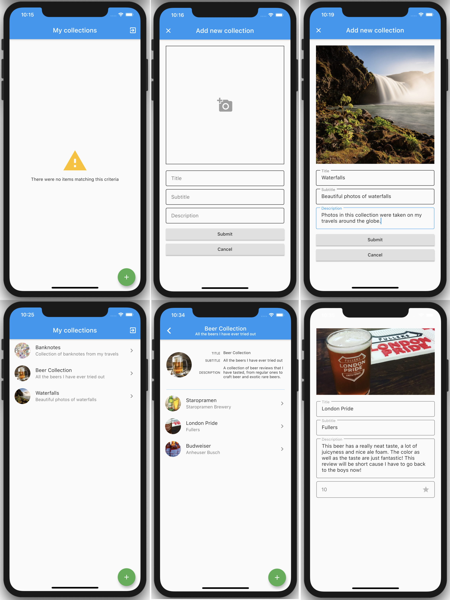

# Stelynx Collectio

_Application for passionate collectors and people that want to keep track of certain things like myself. Written in Flutter and available on iOS and Android._

## Who is this application meant for

This application is meant for collectors, but in no case its usage is limited to collectors only. This application can be used for any kind of keeping track of large ammount of numbers. You can keep track of books that you have at your home library or the books you have read, recipes of the dishes you have prepared, the hikes and climbs you have made, the beer you have tasted, cities you have visited, etc. You can even use it for your own diary!

So, this application has a broad usage, and that's why I like it. On one hand, you do not need a different application for diary, recipes, beer reviews, and collections, but you can rather store them in one neatly organized and content way using this application.

## How it all started

I am a passionate collector of various things, from stamps, Euro coins, world banknotes and coins, to beer reviews, books, and recipes. One cannot really call a list of recipes "collecting", but for me collecting does not necessarilly need to contain an underlying physical thing.

I used to have a blog with beer reviews. It was written in Python using Django and hosted on my old Mac Mini at home. But some day I managed to corrupt the filesystem not thinking I do not have a backup for my database. And so I lost all the data ... Also, that blog only had a Django admin panel where I could add more reviews, therefore it was a bit of a pain in the ass to use it on phone. The poor old guy is [beernburger](https://github.com/campovski/beernburger).

It was few months ago that I heard of Flutter and started learning it right away. I did not have an idea for a project at the very beginning, but then I remembered about my collecting passion and I said to myself, would it not be wonderful if I had an app where I could keep track of my collections.

## User interface

The idea behind design is a very simple one. Use default Material design widgets in Flutter, since Material is awesome, apple few basic stylings on them and we are good to go.

This was the plan for user interface for version one, when the most effort went into learning Flutter and "best architecture".

### Version 1

### Version 2

## Future plans

The application has a lot of potential, therefore it is far from being finished. There is so much one can still learn from implementing it, from complex user interface, to additional functionality, personlized preferences and themes, etc.

The plan for the (near) future can clearly be seen by looking at [issues](https://github.com/stelynx/collectio/issues). Every new feature that crossed my mind or improvement is written as a separate issue. Milestones are used to mark the "priority" of the task, by specifying in which version a feature will be implemented.

## Contributing

Since this is an open-source project, everyone is welcomed to contribute, by opening an issue or even a pull request. However, please read [contributing guidelines](CONTRIBUTING.md) first!

## Acknowledgements

Special thanks go to

- [@felangel](https://github.com/felangel) for helping me with testing BLoC.
- [@Liisjak](https://github.com/Liisjak) for opening _exif world_ to me and suggesting using location.
